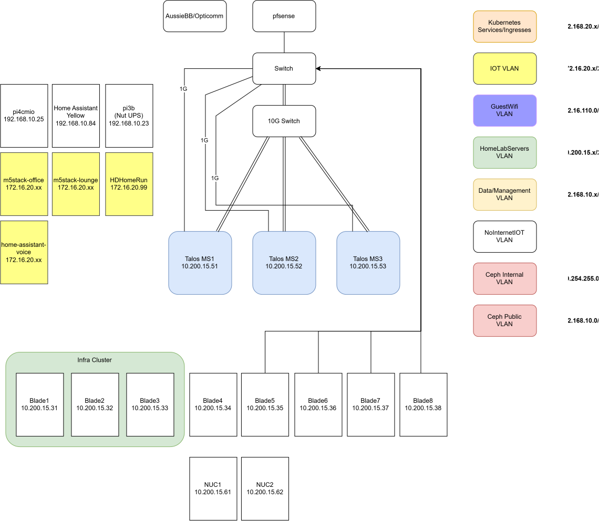

# Home Network Topology

The Home site uses a mixture of 10GB and 1GB Switches

All traffic comes in through an Opensense router
Opensense is bonded

## IP Addressing

### Site Network

The network is vlanned with each vlan using it's own subnet.

| Setting | Value | Subnet | Gateway |
|---------|-------|--------|---------|
| Subnet | 192.168.227.0/24 |
| Gateway | 192.168.227.1 |
| Data VLAN | 10 | 192.168.10.0/24 | 192.168.10.1 |
| HomeLabServers VLAN | 15 | 10.200.15.0/24 | 10.200.15.1 |
| K3SServices VLAN | 20 | 192.168.20.0/24 | 192.168.20.1 |
| Provisioning VLAN | 30 | 192.168.30..0/24 | 192.168.30.1 |
| IOT VLAN | 100 | 172.16.20.0/24 | 172.16.20.1 |
| Guest VLAN | 110 | 172.16.110.0/24 | 172.16.110.1 |

Static allocations are carved out of the /24 by purpose:

| Range | CIDR | Purpose |
|-------|------|---------|
| .192.168.10.3
| .16–.31 | 10.200.15.3/28 | talos nodes |
| .32–.39 | 192.168.227.32/29 | Storage nodes |
| .48–.63 | 192.168.227.48/28 | Kubernetes Multus (L2 pod IPs) |
| .128–.249 | — | DHCP pool |

### Pod and Service Networks

| Network | CIDR |
|---------|------|
| Pod IPv4 | 10.42.0.0/16 |
| Service IPv4 | 10.43.0.0/16 |
| Cluster DNS (IPv4) | 192.168.10.195 |

### DNS

DNS is managed internally by pi-hole (pi-hole on Dynology DS918+). All clients on the network use
the pi-hole as their resolver.

## Network Segmentation

Homelab network uses network segmentation to isolate the traffic between the different VLANs

### Kubernetes pod integration

The fairy-k8s01 cluster uses Cilium CNI for pod networking, which places
pods in a dedicated overlay (10.230.0.0/16) that's unreachable from the
L2 network. Most workloads are fine with this — they consume and expose
services through Kubernetes Services and Gateways. A few workloads need
direct L2 access to the Trusted network for protocols that don't cross
subnet boundaries (mDNS, HomeKit pairing, AirPlay, Thread).

These workloads use [Multus CNI](https://github.com/k8snetworkplumbingwg/multus-cni)
to attach a second interface directly on the Trusted L2 network,
bypassing the pod overlay for that specific traffic.

| Workload | Why L2 is required |
|----------|-------------------|
| Frigate | HomeKit bridge — mDNS advertisement, HomeKit pairing protocol |

Workloads using Multus are classified into the appropriate device group
by MAC address, same as any other device on the Trusted network.

## Device Classification

Devices are placed into groups by one of two mechanisms:

- **WiFi password** — multi-password SSIDs route devices to the correct
  network and group based on which password was used to join. This
  handles the majority of WiFi devices.
- **MAC / device identity** — some devices are classified manually in
  Firewalla by MAC address or by device fingerprint. This covers wired
  devices (which never join via WiFi) and WiFi devices that need to be
  in a specific group regardless of the password they joined with.
